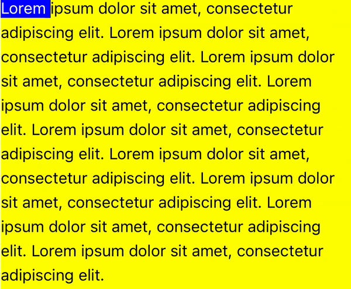

# React Native Text Touch Highlighter

React Native Text Touch Highlighter is a versatile and user-friendly component that allows you to implement text highlighting and selection functionality in your React Native applications. This package simplifies the integration of text selection and annotation features, making it an ideal solution for mobile apps that require text manipulation or document annotation.

<p align="center">
  
</p>

## Installation

To install this package, use npm or yarn:

```bash
npm install react-native-reanimated
npm install react-native-gesture-handler
npm install rn-text-touch-highlight
```

or

```bash
yarn add react-native-reanimated
yarn add react-native-gesture-handler
yarn add rn-text-touch-highlight
```

## Documentation

The docs can be found here: [https://docs.benjamineruvieru.com/rn-text-touch-highlight](https://docs.benjamineruvieru.com/rn-text-touch-highlight)

## Usage

Import the `HighlightText` component in your application and include it in your JSX:

```javascript
import { HighlightText } from 'rn-text-touch-highlight';

export default function App() {
  const highlightRef: any = React.useRef();

  const getHighlightData = () => {
    const data = highlightRef.current?.getHighlightedData();
    console.log(data);
  };
  const deleteFun = (id) => {
    highlightRef.current?.deleteHighlight(id);
  };

  return (
        <HighlightText
          ref={highlightRef}
          clearHighlightOnTap={true}
          highlightInitialDelay={500}
          initialHighlightData={[
            { end: 44, start: 20 },
            { end: 95, start: 70 },
          ]}
          lineSpace={5}
          lineBreakHeight={5}
          textColor={'black'}
          highlightedTextColor={'white'}
          highlightColor={'blue'}
          onHighlightStart={() => {
            console.log('hightStart');
          }}
          onHighlightEnd={(id) => {
            console.log('hightEnd', id);
          }}
          onHighlightTapped={(id, event) => {
            console.log('tapped', id, event);
          }}
          textStyle={{ fontSize: 15 }}
          backgroundColor="yellow"
          text={'Lorem ipsum dolor sit amet, consectetur adipiscing elit.'}
        />
      </View>
  );
}
```

### Props

- `text` (string, required): The text content to display and enable highlighting.
- `textColor` (string): The color of the regular text.
- `highlightedTextColor` (string): The color of the highlighted text.
- `highlightColor` (string): The background color of the highlighted text.
- `lineBreakHeight` (number): The height of line breaks.
- `lineSpace` (number): The space between lines.
- `highlightInitialDelay` (number): Finger press initial delay before highlighting the text. Default is 150 (in milliseconds).
- `onHighlightStart` (function): Callback function when highlighting starts.
- `onHighlightEnd` (function): Callback function when highlighting ends.
- `initialHighlightData` (array of objects): An array specifying the initial highlight data, this is used to render text highlight initially
- `textStyle` (object): Custom styles for the text.
- `marginBottom` (number): Bottom margin for the text container.
- `margin` (number): The margin of the HighlightText component.
- `marginTop` (number): Top margin for the text container.
- `marginLeft` (number): Left margin for the text container.
- `marginRight` (number): Right margin for the text container.
- `onHighlightTapped` (function): Callback function when a highlighted section is tapped.
- `clearHighlightOnTap` (boolean): Clear highlighted sections on tap.

### Ref Functions

- `getHighlightData`: A ref function to retrieve the current highlighting data.
- `deleteHighlight`: A ref function to programmatically delete a highlighted area by its id.

## Example

For a complete example of how to use this package, please refer to the included example app.

## Contributing

See the [contributing guide](CONTRIBUTING.md) to learn how to contribute to the repository and the development workflow.

## License

This package is open-source and available under the MIT License.
